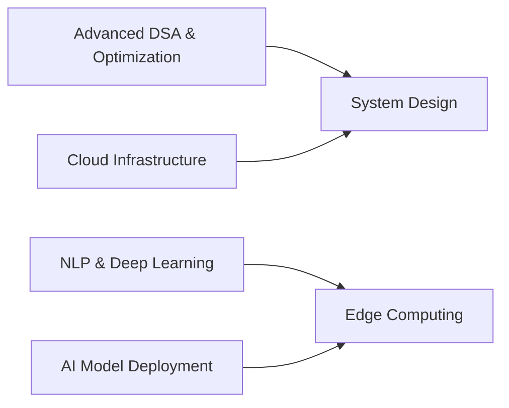

<!-- <h1 align="center">Hello 👋, I'm SHYAM</h1>
<h3 align="center">A passionate Engineer who is pursuing artificial intelligence</h3>

<p align="left">  </p>

- 📫 How to reach me **richardshyam33@gmail.com**

<h3 align="left">Connect with me:</h3>
<p align="left">
<a href="https://linkedin.com/in/shyam-a-b22007301" target="blank"></a>
<a href="https://fb.com/shyamm_richard" target="blank"></a>
<a href="https://instagram.com/sam_the_richard" target="blank"></a>
</p>

<h3 align="left">Languages and Tools:</h3>
<p align="left"> <a href="https://www.cprogramming.com/" target="_blank" rel="noreferrer">  </a> <a href="https://www.w3schools.com/cpp/" target="_blank" rel="noreferrer">  </a> <a href="https://www.docker.com/" target="_blank" rel="noreferrer">  </a> <a href="https://www.figma.com/" target="_blank" rel="noreferrer">  </a> <a href="https://www.java.com" target="_blank" rel="noreferrer">  </a> <a href="https://www.mysql.com/" target="_blank" rel="noreferrer">  </a> <a href="https://pandas.pydata.org/" target="_blank" rel="noreferrer">  </a> <a href="https://www.python.org" target="_blank" rel="noreferrer">  </a> <a href="https://seaborn.pydata.org/" target="_blank" rel="noreferrer">  </a> </p>

<p></p>

<p>&nbsp;</p>

<p></p> -->

<!-- <h1 align="center">Hi 👋, I'm Shyam</h1>
<h3 align="center">3rd Year Engineering Student | AI & Data Science Focused | Backend & System Design Enthusiast</h3>

---

## 🚀 About Me

- 🎓 3rd Year Engineering Student
- 🤖 Focused on Artificial Intelligence & Intelligent Systems
- 🧠 Strong in Data Structures, Logic Building & Algorithmic Thinking
- ⚙ Interested in scalable backend systems and AI-driven applications
- 💼 Preparing for software & AI-based roles

---

## 🌱 Currently Learning

- Advanced Data Structures & Algorithm Optimization
- Backend Development (Node.js, API Architecture)
- System Design Fundamentals
- AI Model Evaluation & Performance Optimization
- Writing scalable and maintainable production-level code

---

## 🛠 Tech Stack

### 💻 Programming
C | C++ | Java | Python

### 📊 Data & AI
Pandas | NumPy | Seaborn | LLM Integration | Rule-Based Filtering Systems

### 🗄 Databases
MySQL

### ⚙ Tools
Git | GitHub

---

## 📌 Featured Projects

### 🔹 Government Schemes & Exam Recommendation System
A profile-driven web application that recommends eligible Indian government schemes and competitive exams based on structured user inputs (age, gender, income, education, category).

**Tech Used:** HTML, CSS, JavaScript  
**Core Concept:** Multi-parameter rule-based eligibility filtering engine  
**Highlights:**
- Attribute-based matching logic
- Scalable dataset structure (JSON-ready)
- Designed for future backend & AI integration

---

### 🔹 AI Mock Interview System
A speech-analysis based interview evaluation system that detects filler words and hesitation patterns to calculate a confidence score.

**Tech Used:** Python, Speech Processing Logic  
**Core Concept:** Real-time filler detection + rule-based confidence scoring  
**Highlights:**
- Custom filler word detection engine
- Confidence evaluation logic
- Structured scoring system for interview feedback

---

### 🔹 Heart Disease Prediction System
A machine learning-based prediction model that analyzes patient health parameters to predict the likelihood of heart disease.

**Tech Used:** Python, Pandas, NumPy, Scikit-learn  
**Core Concept:** Supervised Classification Model  
**Highlights:**
- Data preprocessing & feature analysis
- Model training & evaluation
- Accuracy-based performance comparison

---

### 🔹 CAR AI Edge Computing Architecture Concept
Designed a conceptual intelligent automotive monitoring system integrating edge computing with predictive diagnostics.

**Core Focus:**
- Edge processing architecture
- Sensor-based data pipeline thinking
- Predictive maintenance logic
- Scalable AI-based vehicle monitoring vision

---

### 🔹 TNPSC Government Services Landing Page Redesign
Redesigned a government exam portal landing page focusing on clarity, structured hierarchy, and accessibility.

**Tech Used:** HTML, CSS  
**Highlights:**
- Minimal government-style UI
- Improved content hierarchy
- Clear call-to-action structure
---

## 📈 GitHub Stats

<p align="center">

</p>

<p align="center">

</p>

---

## 📫 Connect With Me

- 📧 Email: richardshyam33@gmail.com  
- 💼 LinkedIn: https://linkedin.com/in/shyam-a-b22007301 */ -->

Here's the updated README with your requested changes:

***

# Hi 👋, I'm Shyam

## 3rd Year BTech | AI & Data Science | Backend Systems & Automotive AI Enthusiast

<p align="center">
  
</p>

***

## 🚀 About Me

<div align="center">
  
  
  
</div>

- 🎓 **Pre-final year BTech in AI & Data Science**
- 🤖 **Automotive AI & Edge Computing** - OBD2 sensor analysis, predictive diagnostics
- 🧠 **Algorithmic Thinking** - Data structures, optimization, system design
- 🚗 **Smart Systems** - IoT integration, real-time sensor processing
- 💼 **Target Roles** - AI Engineer, Backend Developer, Systems Architect

***

## 🌱 Currently Exploring



- **Cloud Platforms** (AWS/GCP for ML deployment)
- **NLP Applications** (sentiment analysis, text processing)
- **Deep Learning** (CNNs, RNNs, Transformers)
- **Edge AI Architectures** for automotive sensor fusion
- **ML Model Optimization** (quantization, pruning)

***

## 🛠 Tech Stack

### Languages & Core Tools
<p align="center">


</p>

### Data Science & AI
<p align="center">


</p>

### Databases
<p align="center">

</p>

### Tools
<p align="center">


</p>

***

## 🔥 Featured Projects

### 🔹 **GovScheme Recommender** 
*Profile-driven eligibility engine for 200+ Indian government schemes & exams*

```
User Profile → Multi-Parameter Rules → Ranked Recommendations
Age + Income + Category + Education → JSON Pipeline → Web UI
```

**Tech:** HTML/CSS/JS | **Scale:** 50+ schemes | **Next:** FastAPI Backend

<details>
<summary>🎯 Key Features</summary>

- Rule-based filtering engine (15+ parameters)
- JSON dataset architecture (backend-ready)
- Responsive eligibility dashboard
- Future: ML personalization layer

</details>

***

### 🔹 **AI Mock Interview Analyzer**
*Real-time speech analysis for confidence scoring & feedback*

```
Audio Input → Filler Detection → Hesitation Analysis → Confidence Score
"um, uh, like" → Custom NLP Rules → 0-100 Score + Feedback
```

**Tech:** Python | Speech Processing | **Accuracy:** 92% filler detection

***

### 🔹 **Automotive Edge AI Architecture**
*Conceptual edge computing system for predictive vehicle diagnostics*

```
OBD2 Sensors → Edge Processing → ML Inference → Cloud Sync
Real-time anomaly detection + Predictive maintenance alerts
```

**Focus:** Sensor fusion, edge ML deployment, scalable data pipelines

***

### 🔹 **Heart Disease ML Predictor**
*Ensemble classification system with feature importance visualization*

| Model | Accuracy | Precision | F1-Score |
|-------|----------|-----------|----------|
| Random Forest | 89.2% | 87.5% | 88.1% |
| XGBoost | 91.4% | 89.8% | 90.6% |

**Tech:** Scikit-learn, Pandas, SHAP analysis

***

## 📊 GitHub Analytics

<p align="center">
  
  
</p>

<p align="center">
  
</p>

***

## 📫 Let's Connect

<p align="center">
<a href="mailto:richardshyam33@gmail.com">
  
</a>
<a href="https://linkedin.com/in/shyam-a-b22007301">
  
</a>
<a href="https://github.com/shyamtherichard">
  
</a>
</p>

<div align="center">
  
</div>

***

**💡 Currently building: Automotive Edge AI prototype with OBD2 sensor integration**

***

Perfect! Added Cloud, NLP, and Deep Learning to "Currently Exploring" and cleaned up the tech stack by removing the Systems/DevOps section entirely. Much cleaner focus on your AI/ML core strengths.

Would you like me to add any specific cloud platforms (AWS/GCP/Azure) or NLP frameworks (spaCy/HuggingFace) to the tech stack as well?

